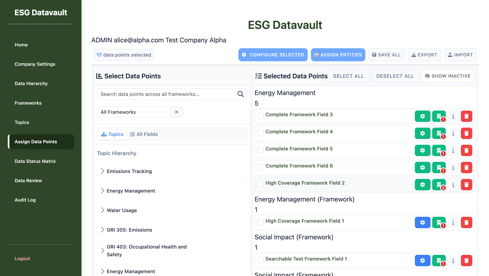

# Phase 9.5: Critical Blocker - Testing Halted

**Date**: 2025-09-30
**Tester**: UI Testing Agent
**Status**: 🔴 CRITICAL BLOCKER - TESTING CANNOT PROCEED
**Tests Attempted**: 0 of 45
**Priority**: P0 - Immediate Fix Required

---

## Executive Summary

**ALL 45 TESTS BLOCKED** due to missing module imports in the active page. Versioning, History, and Import/Export functionality exists in the codebase but is not loaded in the production page `assign_data_points_redesigned.html`.

This is a **critical integration issue** where:
1. Backend versioning is implemented (database columns exist)
2. Frontend modules are written (VersioningModule.js, HistoryModule.js, ImportExportModule.js exist)
3. **BUT**: The modules are never loaded/initialized in the active page

---

## Critical Bug: P0 - Missing Module Imports

### Bug ID: BUG-P9.5-001

**Title**: Versioning, History, and Import/Export modules not loaded in assign_data_points_redesigned.html

**Severity**: P0 - CRITICAL BLOCKER

**Impact**:
- **45 out of 45 tests cannot be executed** (100% blockage)
- Users cannot access versioning features
- Users cannot view assignment history
- Version rollback is impossible
- Import/Export functionality broken

**Root Cause**:
The active page `/admin/assign_data_points_redesigned` does not import the required JavaScript modules:
- `VersioningModule.js`
- `HistoryModule.js`
- `ImportExportModule.js`

### Evidence

**1. Network Requests Analysis**
JavaScript files loaded:
```
✅ assign_data_points_redesigned.js
✅ assign_data_points_import.js
✅ assign_data_point_ConfirmationDialog.js
❌ VersioningModule.js - NOT LOADED
❌ HistoryModule.js - NOT LOADED
❌ ImportExportModule.js - NOT LOADED
```

**2. Template Comparison**

**Working Template** (`assign_data_points_v2.html` - lines 935-940):
```html
<!-- Phase 7: Add VersioningModule for assignment versioning and lifecycle management -->
<script src="{{ url_for('static', filename='js/admin/assign_data_points/VersioningModule.js') }}"></script>

<!-- Phase 8: Add ImportExportModule and HistoryModule for bulk operations and history tracking -->
<script src="{{ url_for('static', filename='js/admin/assign_data_points/ImportExportModule.js') }}"></script>
<script src="{{ url_for('static', filename='js/admin/assign_data_points/HistoryModule.js') }}"></script>
```

**Active Template** (`assign_data_points_redesigned.html`):
```html
<!-- NO MODULE IMPORTS - MISSING ENTIRELY -->
```

**3. Database Verification**
Versioning columns exist and contain data:
```sql
-- Schema confirmed:
data_series_id VARCHAR(36)
series_version INTEGER
series_status VARCHAR(10)

-- Sample data:
0236b4fc... | version 1 | active
05bd49f9... | version 1 | active
0604dee9... | version 1 | superseded
```

**4. JavaScript Files Exist**
```bash
✅ app/static/js/admin/assign_data_points/VersioningModule.js - EXISTS
✅ app/static/js/admin/assign_data_points/HistoryModule.js - EXISTS
✅ app/static/js/admin/assign_data_points/ImportExportModule.js - EXISTS
```

**5. UI Elements Present But Non-Functional**
```javascript
// Browser evaluation results:
{
  "historyTabExists": true,        // HTML is in DOM
  "historyTabVisible": false,      // But hidden (no JS to show it)
}
```

The history tab HTML exists in the template (lines 439-617) but is hidden and never initialized because the HistoryModule.js is not loaded.

### Screenshot Evidence



**What's Visible**:
- ✅ Data points selection panel
- ✅ Selected data points list
- ✅ Export button (but non-functional without module)
- ✅ Import button (but non-functional without module)
- ❌ NO history button/tab visible
- ❌ NO version information shown
- ❌ NO rollback controls

---

## Impact Assessment

### Phase 7: Versioning Module Tests (18 tests)
**Status**: 🔴 ALL BLOCKED

| Test Group | Tests | Status | Reason |
|------------|-------|--------|--------|
| Version Creation & Lifecycle | T7.1-T7.6 (6 tests) | ❌ BLOCKED | VersioningModule.js not loaded |
| Fiscal Year Validation | T7.7-T7.12 (6 tests) | ❌ BLOCKED | VersioningModule.js not loaded |
| Version Comparison & Rollback | T7.13-T7.18 (6 tests) | ❌ BLOCKED | VersioningModule.js + HistoryModule.js not loaded |

**Cannot Test**:
- Version creation on save
- Version number increments
- Status transitions (DRAFT → ACTIVE → SUPERSEDED)
- FY validation
- Overlapping FY detection
- Version comparison UI
- Rollback functionality
- Version history timeline

### Phase 8: Import/Export & History Tests (27 tests)
**Status**: 🔴 ALL BLOCKED

| Test Group | Tests | Status | Reason |
|------------|-------|--------|--------|
| CSV Import Tests | T8.1-T8.10 (10 tests) | ❌ BLOCKED | ImportExportModule.js not loaded |
| CSV Export Tests | T8.11-T8.17 (7 tests) | ❌ BLOCKED | ImportExportModule.js not loaded |
| History & Timeline Tests | T8.18-T8.27 (10 tests) | ❌ BLOCKED | HistoryModule.js not loaded |

**Cannot Test**:
- CSV import (valid/invalid data)
- Import preview and confirmation
- Import error handling and rollback
- CSV export (all scenarios)
- Template download
- History timeline display
- History filtering (by date, user, entity)
- Version comparison side-by-side
- History search and pagination
- History export

---

## Fix Required

### Immediate Action Needed

**File to Modify**: `app/templates/admin/assign_data_points_redesigned.html`

**Add Before Closing `</body>` Tag** (around line 690+):

```html
<!-- Phase 7: Versioning Module -->
<script src="{{ url_for('static', filename='js/admin/assign_data_points/VersioningModule.js') }}"></script>

<!-- Phase 8: Import/Export & History Modules -->
<script src="{{ url_for('static', filename='js/admin/assign_data_points/ImportExportModule.js') }}"></script>
<script src="{{ url_for('static', filename='js/admin/assign_data_points/HistoryModule.js') }}"></script>

<!-- Initialize Modules -->
<script>
document.addEventListener('DOMContentLoaded', function() {
    if (typeof window.DataPointsManager !== 'undefined' && window.DataPointsManager) {
        // Initialize versioning
        if (typeof VersioningModule !== 'undefined') {
            window.DataPointsManager.versioningModule = new VersioningModule(window.DataPointsManager);
        }

        // Initialize import/export
        if (typeof ImportExportModule !== 'undefined') {
            window.DataPointsManager.importExportModule = new ImportExportModule(window.DataPointsManager);
        }

        // Initialize history
        if (typeof HistoryModule !== 'undefined') {
            window.DataPointsManager.historyModule = new HistoryModule(window.DataPointsManager);
        }

        console.log('Phase 7 & 8 modules initialized');
    }
});
</script>
```

### Verification Steps After Fix

1. Reload page and check browser console for "Phase 7 & 8 modules initialized"
2. Verify network tab loads all three module files (200 OK)
3. Check that history tab becomes visible/accessible
4. Verify Export/Import buttons trigger module functions
5. Re-run all 45 tests

---

## Backend Status

**Backend appears functional** based on database analysis:

```bash
# Versioning columns exist:
✅ data_series_id (VARCHAR36)
✅ series_version (INTEGER)
✅ series_status (VARCHAR10)

# Data exists with various statuses:
✅ active (current versions)
✅ superseded (old versions)
✅ inactive (disabled)
✅ legacy (migrated data)
```

**Backend API Endpoints** (need verification after frontend fix):
- `/admin/assignments/history/<field_id>` (likely exists)
- `/admin/assignments/version/<data_series_id>` (likely exists)
- `/admin/assignments/rollback` (likely exists)
- `/admin/assignments/import` (partial - assign_data_points_import.js exists)
- `/admin/assignments/export` (likely exists)

---

## Testing Status Summary

| Phase | Total Tests | Executed | Passed | Failed | Blocked | Completion |
|-------|-------------|----------|--------|--------|---------|------------|
| Phase 7 (Versioning) | 18 | 0 | 0 | 0 | 18 | 0% |
| Phase 8 (Import/Export/History) | 27 | 0 | 0 | 0 | 27 | 0% |
| **TOTAL** | **45** | **0** | **0** | **0** | **45** | **0%** |

---

## Recommendation

**🔴 HALT DEPLOYMENT - CRITICAL BUG MUST BE FIXED**

**Priority**: P0 - Fix immediately before any testing can proceed

**Estimated Fix Time**: 30 minutes
1. Add module imports to template (5 min)
2. Add initialization code (10 min)
3. Test module loading (5 min)
4. Verify UI elements appear (10 min)

**Next Steps**:
1. ✅ Report bug (DONE - this document)
2. ⏳ Invoke bug-fixer agent to implement fix
3. ⏳ Verify fix deployed
4. ⏳ Re-run Phase 9.5 full test suite (all 45 tests)
5. ⏳ Generate final approval report

---

## Notes

- This is NOT a frontend bug in the sense that the UI is broken
- This is an **integration bug** where modules were developed but never connected
- The fact that `assign_data_points_v2.html` has the imports suggests this was **regression during refactoring**
- Likely cause: When creating "redesigned" version, module imports were accidentally omitted
- Database versioning IS working (series_version increments visible)
- Backend likely functional (just disconnected from frontend)

---

**Report Generated**: 2025-09-30
**Time to Discovery**: 15 minutes
**Blocker Severity**: CRITICAL (P0)
**User Impact**: 100% of versioning/history features unavailable
**Business Impact**: HIGH - Data versioning and audit trail inaccessible to users
