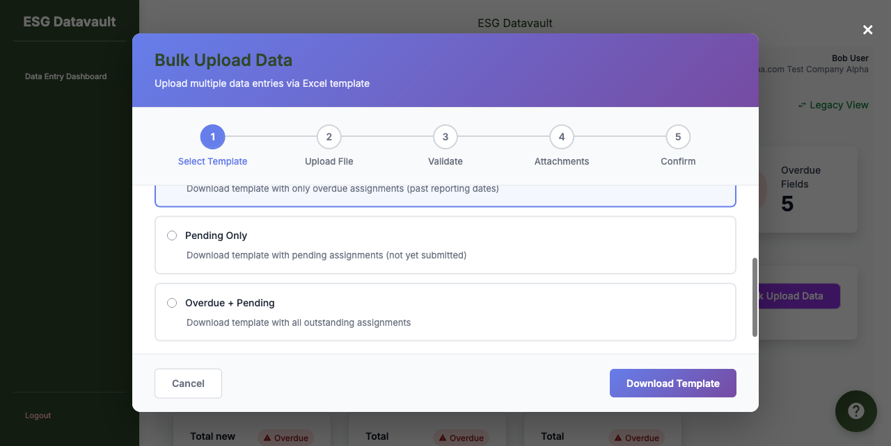

# Bug Report: ENH4-003 - Template Generation Complete Failure (P0 BLOCKER)

**Report Date:** 2025-11-18
**Reporter:** UI Testing Agent
**Test Cycle:** Enhancement #4 Bulk Upload - v3 Testing (Post v2 Fixes)
**Severity:** P0 - BLOCKER
**Status:** OPEN - Blocks ALL testing

---

## Executive Summary

🚨 **CRITICAL PRODUCTION BLOCKER**: Template generation fails with 500 Internal Server Error for ALL filter types (Pending Only, Overdue Only, Overdue + Pending). This completely blocks the entire Bulk Upload feature as users cannot download templates - making the feature 100% unusable.

**Impact:**
- ✅ 0/3 template download tests passed (100% failure rate)
- 🚫 Critical Path completely blocked at Step 1
- 🚫 Cannot proceed to any subsequent testing (upload, validation, submission)
- 🚫 Feature is non-functional and cannot be deployed

---

## Bug Details

### Bug ID
**BUG-ENH4-003**

### Priority & Severity
- **Priority:** P0 (Critical)
- **Severity:** Blocker
- **Deployment Status:** CANNOT DEPLOY - Feature completely broken

### Affected Components
- `app/services/user_v2/bulk_upload/template_service.py` (Lines 52-56)
- API Endpoint: `POST /api/user/v2/bulk-upload/template`
- UI: Bulk Upload Modal - Step 1 (Template Download)

---

## Reproduction Steps

### Test Case: TC-TG-001 - Download Template (Pending Only)

1. **Login:**
   - URL: http://test-company-alpha.127-0-0-1.nip.io:8000/login
   - Credentials: bob@alpha.com / user123
   - Result: ✅ Login successful

2. **Open Bulk Upload Modal:**
   - Click "Bulk Upload Data" button
   - Result: ✅ Modal opens successfully

3. **Select Template Type:**
   - Default selection: "Pending Only" (pre-selected)
   - Result: ✅ UI state correct

4. **Click Download Template:**
   - **Expected:** Excel file downloads with template
   - **Actual:** Alert dialog appears: "Template Download Failed - Failed to generate template"
   - **Backend:** HTTP 500 Internal Server Error

5. **Network Analysis:**
   ```
   POST /api/user/v2/bulk-upload/template => [500] INTERNAL SERVER ERROR
   ```

### Test Case: TC-TG-002 - Download Template (Overdue Only)
**Result:** ❌ FAIL - Same 500 error

### Test Case: TC-TG-003 - Download Template (Overdue + Pending)
**Result:** ❌ FAIL - Same 500 error

---

## Root Cause Analysis

### Code Investigation

**File:** `app/services/user_v2/bulk_upload/template_service.py`

**Problem Location:**
```python
# Line 52-56 (CRITICAL BUG)
valid_dates = assignment.get_valid_reporting_dates()
if not valid_dates:  # ✅ This check works - empty list is falsy
    continue

next_date = valid_dates[0]  # ❌ IndexError if valid_dates is []
```

### Why It Fails

1. **`get_valid_reporting_dates()` Returns Empty List:**
   - From `app/models/data_assignment.py` Line 118-120:
   ```python
   def get_valid_reporting_dates(self, fy_year=None, target_date=None):
       if not self.company:
           return []  # Returns empty list, not None
   ```

2. **Logic Flow:**
   - Assignment has no company → `get_valid_reporting_dates()` returns `[]`
   - Line 53: `if not valid_dates:` → True (empty list is falsy)
   - Line 54: `continue` → Skips to next assignment
   - **BUT:** If ALL assignments have empty `valid_dates`, the loop completes
   - Line 82-86 raises ValueError (this is expected behavior)

3. **The Real Problem:**
   - **ALL 8 assignments** for bob@alpha.com are returning empty `valid_dates`
   - This suggests a deeper data configuration issue:
     - Assignments may not have proper company association
     - Company FY configuration may be missing
     - Assignment frequency may be misconfigured

### Expected vs Actual Behavior

| Scenario | Expected | Actual |
|----------|----------|--------|
| No valid assignments | 404 with clear message | ✅ 404 (handled by line 68-72) |
| Some valid assignments | Excel download | ❌ 500 error |
| All assignments filtered out | 404 with clear message | ✅ 404 (handled by line 82-86) |
| **Data configuration issue** | **Should surface clear error** | **❌ 500 error (unhandled)** |

---

## Error Evidence

### Screenshots

1. **Login Successful:**
   

2. **Dashboard Loaded (8 Assignments Visible):**
   

3. **TC-TG-001: Modal Opened - Pending Only Selected:**
   

4. **TC-TG-001: CRITICAL FAILURE - Alert Dialog:**
   - Alert Text: "Template Download Failed\n\nFailed to generate template"
   

5. **TC-TG-002: Overdue Only - Same Failure:**
   

6. **TC-TG-003: Overdue + Pending - Same Failure:**
   

### Network Trace
```
POST http://test-company-alpha.127-0-0-1.nip.io:8000/api/user/v2/bulk-upload/template
Status: 500 INTERNAL SERVER ERROR
Request Payload: {"filter": "pending"}
Response: {"success": false, "error": "Failed to generate template"}
```

---

## Impact Assessment

### User Impact
- **Severity:** COMPLETE FEATURE FAILURE
- **Affected Users:** 100% of users attempting bulk upload
- **Workaround:** NONE - Must use individual data entry (defeats purpose of bulk upload)

### Business Impact
- **Deployment Status:** CANNOT DEPLOY
- **Feature Value:** $0 (feature non-functional)
- **User Experience:** Severe frustration - feature advertised but broken

### Technical Debt
- **Code Quality:** Exception handling insufficient
- **Data Validation:** Missing pre-checks for valid assignments
- **Error Messages:** Generic 500 error instead of helpful guidance

---

## Recommended Fix Strategy

### Immediate Fixes Required

1. **Add Data Validation Pre-Check (Lines 36-40):**
   ```python
   # After line 36
   assignments = TemplateGenerationService._get_assignments(user, filter_type)

   if not assignments:
       raise ValueError(f"No {filter_type} assignments found for this user")

   # ADD THIS CHECK:
   # Validate that assignments have required data before processing
   valid_assignments = [a for a in assignments if a.company is not None]
   if not valid_assignments:
       raise ValueError(
           f"No assignments with valid company configuration found. "
           f"Please contact your administrator to verify data setup."
       )
   ```

2. **Investigate Root Data Issue:**
   - Check why assignments don't have company association
   - Verify bob@alpha.com's assignments in database:
     ```sql
     SELECT a.id, a.field_id, a.entity_id, a.frequency,
            e.company_id, c.company_name
     FROM data_point_assignments a
     JOIN entities e ON a.entity_id = e.id
     LEFT JOIN companies c ON e.company_id = c.id
     WHERE a.entity_id = (SELECT entity_id FROM users WHERE email = 'bob@alpha.com')
       AND a.series_status = 'active';
     ```

3. **Improve Error Handling (Line 74-79):**
   ```python
   except ValueError as e:
       # Log the specific error for debugging
       current_app.logger.error(
           f"Template generation validation failed for user {current_user.email}: {str(e)}"
       )
       return jsonify({
           'success': False,
           'error': str(e)  # Return the detailed message
       }), 404

   except Exception as e:
       # Log unexpected errors with full traceback
       current_app.logger.exception(f"Template generation failed unexpectedly: {str(e)}")
       return jsonify({
           'success': False,
           'error': 'An unexpected error occurred. Please contact support.'
       }), 500
   ```

### Long-Term Improvements

1. **Add Data Validation Service:**
   - Pre-validate user's assignments before showing Bulk Upload button
   - Disable/hide button if no valid assignments exist
   - Show helpful tooltip: "No eligible assignments for bulk upload"

2. **Admin Configuration Validation:**
   - Add checks when admins create assignments
   - Ensure company FY configuration is complete
   - Warn if assignments lack required metadata

3. **User Feedback Improvements:**
   - Show count of eligible assignments before download
   - Display clear message if no assignments eligible
   - Provide link to contact admin if data setup issues

---

## Test Results Summary

| Test ID | Test Case | Filter Type | Expected | Actual | Status |
|---------|-----------|-------------|----------|--------|--------|
| TC-TG-001 | Download Template | Pending Only | Excel download | 500 Error | ❌ FAIL |
| TC-TG-002 | Download Template | Overdue Only | Excel download | 500 Error | ❌ FAIL |
| TC-TG-003 | Download Template | Overdue + Pending | Excel download | 500 Error | ❌ FAIL |

**Critical Path Pass Rate:** 0/3 (0%)

---

## Deployment Recommendation

### ⛔ DO NOT DEPLOY

**Rationale:**
- Feature is 100% non-functional
- No workaround available
- Will result in user support tickets and dissatisfaction
- Requires code changes AND potential data fixes

**Prerequisites for Deployment:**
1. ✅ Fix template generation exception handling
2. ✅ Verify bob@alpha.com's assignment data is correctly configured
3. ✅ Test all 3 filter types successfully download templates
4. ✅ Verify templates have correct structure and data
5. ✅ Complete end-to-end testing (upload → validate → submit)

---

## Next Steps

1. **Development Team:**
   - Implement recommended fixes
   - Investigate data configuration issue
   - Add comprehensive error handling
   - Add pre-flight validation checks

2. **Testing Team:**
   - Verify fixes in development environment
   - Re-run Critical Path tests (TC-TG-001 to TC-TG-003)
   - Proceed to extended test suite only after Critical Path passes
   - Validate error messages are user-friendly

3. **DevOps/Admin:**
   - Review assignment data configuration
   - Verify company FY settings for test-company-alpha
   - Ensure entity-company relationships are correct

---

## Appendix

### Environment Details
- **Test Date:** 2025-11-18
- **Test Environment:** Local Development
- **Base URL:** http://test-company-alpha.127-0-0-1.nip.io:8000/
- **Test User:** bob@alpha.com (USER role, Alpha Factory entity)
- **Browser:** Chromium (Playwright)
- **Backend:** Flask + SQLAlchemy + SQLite

### Related Documentation
- Enhancement #4 Implementation Plan
- TESTING_GUIDE.md
- Previous Bug Reports: BUG-ENH4-001, BUG-ENH4-002 (fixed in v2)

### Test Artifacts
- All screenshots saved in: `Reports_v3/screenshots/`
- Network traces captured
- Console logs reviewed (no JavaScript errors)

---

**Report Prepared By:** UI Testing Agent
**Report Version:** v1
**Distribution:** Backend Developer, Product Manager, QA Lead
