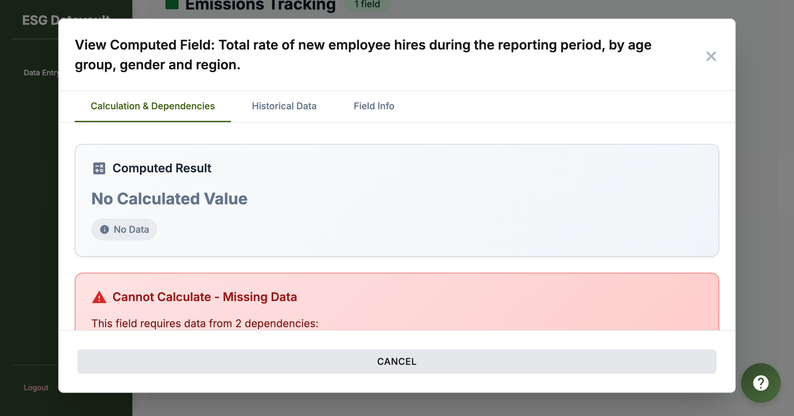
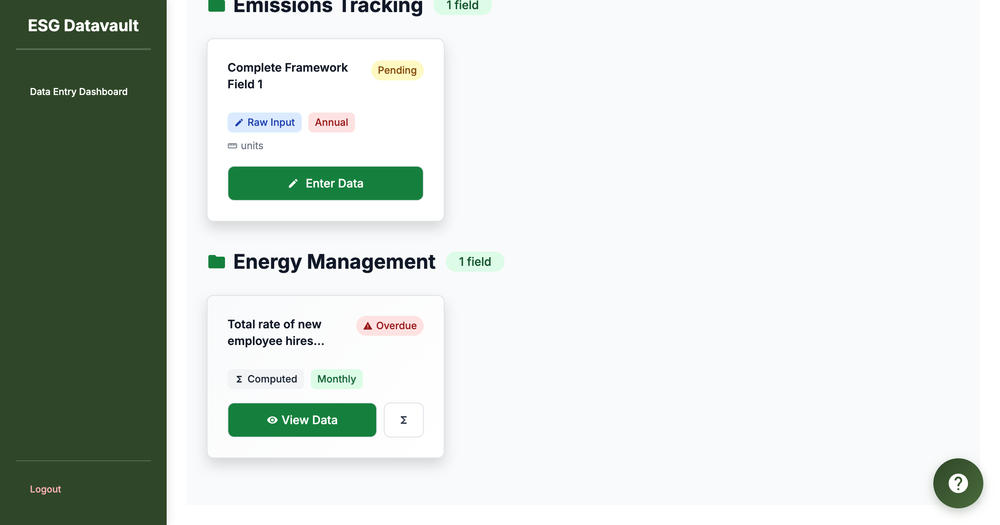

# CRITICAL BUG REPORT: Enhancement #1 - Edit Dependency Button Not Working

**Bug ID:** ENH1-BUG-002-REOPEN
**Date Reported:** 2025-11-15
**Reporter:** UI Testing Agent
**Severity:** CRITICAL
**Priority:** HIGH
**Status:** OPEN (Bug Fix #2 claimed as complete but NOT working)

---

## Bug Summary

The "ADD DATA" button in the computed field modal still shows an alert dialog instead of opening the dependency modal programmatically. This indicates that Bug Fix #2 (dual-method modal opening) is NOT working as claimed.

---

## Environment

- **URL:** http://test-company-alpha.127-0-0-1.nip.io:8000/user/v2/dashboard
- **User:** bob@alpha.com (USER role)
- **Company:** Test Company Alpha
- **Entity:** Alpha Factory (Manufacturing)
- **Browser:** Chrome (via Chrome DevTools MCP)
- **Field Tested:** "Total rate of new employee hires during the reporting period..."

---

## Steps to Reproduce

1. Login as bob@alpha.com
2. Navigate to user dashboard
3. Scroll to computed field "Total rate of new employee hires..."
4. Click "View Data" button
5. Wait for computed field modal to open
6. Scroll to Dependencies section
7. Locate "Total new hires" row (Variable A)
8. Click "ADD DATA" button

---

## Expected Behavior

Based on Bug Fix #2 implementation (computed_field_view.js:341-426):

1. NO alert should appear
2. Current computed field modal should close
3. After ~300ms delay, dependency modal should open
4. New modal should show:
   - Title: "Enter Data: Total new hires"
   - Form with input fields
   - "Save Data" button

**Expected Console Logs:**
```
[ComputedFieldView] Opening dependency modal: {fieldId, fieldName, fieldType}
[ComputedFieldView] Field card not found, opening modal programmatically
```

---

## Actual Behavior

1. Alert dialog appears with message: "Please navigate to 'Total new hires' field card on the dashboard to enter data."
2. User must manually dismiss the alert
3. Computed field modal closes
4. NO dependency modal opens
5. User is left on the dashboard

**Actual Console Logs:**
```
[ComputedFieldView] Opening dependency modal: JSHandle@object
[ComputedFieldView] Field card not found, opening modal programmatically
```

**Note:** The console logs show the correct code path is executing, but an alert() is still being called somewhere in the flow.

---

## Visual Evidence

### Before Clicking ADD DATA


**Description:** Computed field modal showing Dependencies section with "ADD DATA" buttons for missing fields.

### After Clicking ADD DATA (FAILURE)


**Description:** Dashboard view after alert was dismissed. The alert appeared instead of the dependency modal opening.

---

## Root Cause Analysis

### Code Investigation Required

**Primary Suspect:** `computed_field_view.js:341-426`

The console logs indicate:
1. The `openDependencyModal()` function is being called
2. The field card is not found (expected for unassigned fields)
3. The programmatic opening branch is being executed

**However:** An alert() is still appearing, which means either:
1. There's a remaining alert() call in the code path
2. The programmatic modal opening is failing and triggering an error handler with alert()
3. There's a different event handler intercepting the click and showing the alert

### Suggested Investigation Steps

1. Search for all `alert()` calls in `computed_field_view.js`
2. Check if there's an error handler catching exceptions from programmatic modal opening
3. Verify the `openModal()` function is imported and available
4. Check if there's an old event handler still attached to the "ADD DATA" buttons
5. Review the DOM structure to ensure the programmatic modal opening has the correct selectors

---

## Impact Assessment

### User Impact: HIGH

**Workflow Broken:**
- Users cannot quickly add missing dependency data from the computed field modal
- Users must:
  1. Close the computed field modal
  2. Navigate the dashboard to find the dependency field card
  3. Click "Enter Data" on the dependency field
  4. Enter the data
  5. Navigate back to the computed field
  6. Open the computed field modal again to see the updated calculation

**Instead of Expected Flow:**
- Users should be able to click "ADD DATA" and immediately enter dependency data
- After saving, the computed field should recalculate automatically
- This is the core value proposition of Enhancement #1

### Business Impact: HIGH

- Feature is incomplete and provides poor user experience
- Users will revert to manual navigation, negating the enhancement's value
- May cause confusion and frustration
- Cannot be released to production in this state

---

## Related Bugs

- **Bug Fix #1:** Date Fallback Logic - VERIFIED WORKING ✅
- **Bug Fix #2:** Dual-Method Modal Opening - FAILED (THIS BUG) ❌
- **Bug Fix #3:** Duplicate Event Listener Conflict - VERIFIED WORKING ✅

---

## Testing Evidence

**Test Case:** TC3 - Edit Dependency Button Works
**Result:** FAILED
**Pass Rate:** 71% (5/7 tests passed, 1 failed, 1 skipped due to this bug)

**Console Logs:**
```
msgid=45 [log] [ComputedFieldView] Opening dependency modal: JSHandle@object
msgid=46 [log] [ComputedFieldView] Field card not found, opening modal programmatically
```

**Network Activity:**
- No API calls were made after clicking "ADD DATA" (confirms modal didn't open)

---

## Recommended Actions

### Immediate Actions

1. **Code Review:** Review `computed_field_view.js:341-426` line by line
2. **Search for alert():** Find all alert() calls related to dependency modal opening
3. **Test Programmatic Opening:** Verify `openModal()` function works independently
4. **Event Handler Audit:** Check for duplicate or conflicting event handlers

### Testing Requirements

After fix is applied:
1. Re-run TC3: Edit Dependency Button Works
2. Run TC4: End-to-End Edit Workflow (currently skipped)
3. Verify no regressions in TC1, TC2, TC5, TC6
4. Conduct full regression testing

### Code Changes Required

**Estimated Effort:** 2-4 hours
**Developer:** Backend Developer or UI Developer
**Reviewer:** UI Testing Agent (for validation)

---

## Acceptance Criteria for Fix

The bug will be considered FIXED when:

1. Clicking "ADD DATA" button does NOT show an alert
2. Clicking "ADD DATA" button closes the computed field modal
3. After ~300ms, the dependency modal opens programmatically
4. The dependency modal shows the correct field data entry form
5. The console logs show:
   - "[ComputedFieldView] Opening dependency modal: {fieldId, fieldName, fieldType}"
   - "[ComputedFieldView] Field card not found, opening modal programmatically"
   - NO alert-related errors
6. TC3 test case PASSES
7. TC4 test case PASSES

---

## Additional Notes

### Workaround for Users

Until this bug is fixed, users can:
1. Note which dependencies are missing from the computed field modal
2. Close the modal
3. Manually find the dependency field on the dashboard
4. Enter the data for the dependency field
5. Return to the computed field and open the modal again

**This workaround defeats the purpose of Enhancement #1.**

### Development Team Notes

The implementation claimed Bug Fix #2 was complete, but testing reveals it is NOT working. This suggests:
1. The fix was partially implemented
2. The fix was tested in a different scenario
3. There's a regression from another change
4. The alert() is in a different code path than expected

---

**Report Generated:** 2025-11-15
**Next Review:** After fix is implemented
**Status:** BLOCKING PRODUCTION RELEASE
