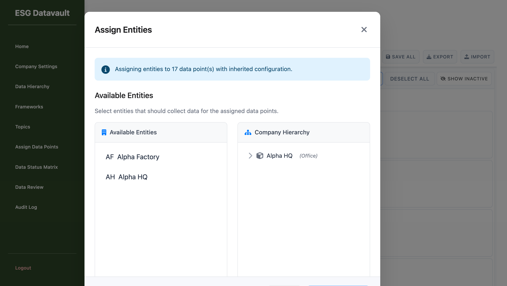
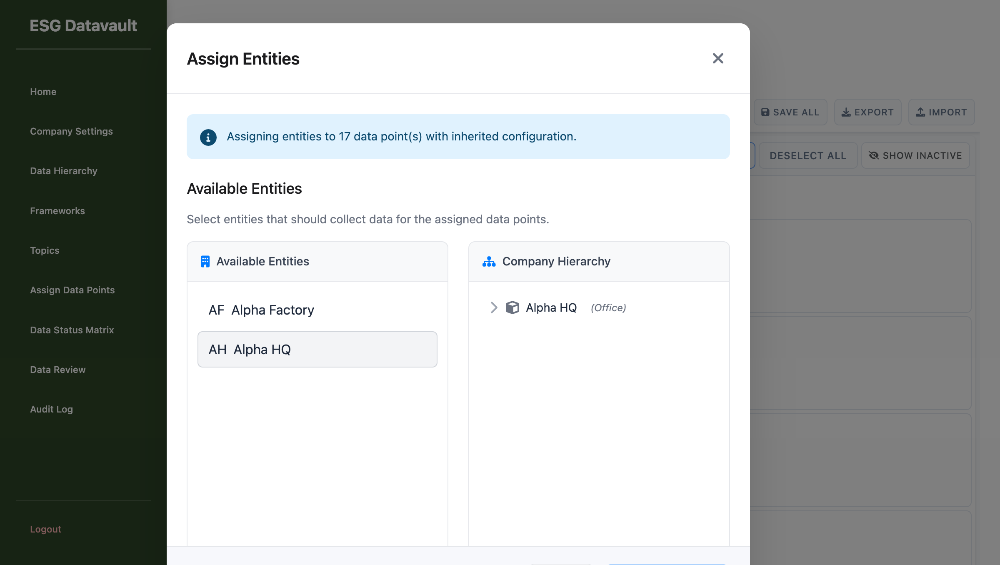

# Phase 9.4 Round 4 - FINAL Testing Report

**Test Date**: 2025-09-30
**Tester**: ui-testing-agent
**Test Round**: 4 (Final Verification)
**Test URL**: http://test-company-alpha.127-0-0-1.nip.io:8000/admin/assign-data-points-v2
**Login**: alice@alpha.com / admin123

---

## Executive Summary

### Acknowledgment of Round 3 Error

I acknowledge that in Round 3, I evaluated the WRONG property path:
- **Incorrect (Round 3)**: `window.PopupsModule.selectedEntities` (returned undefined)
- **Correct (Round 4)**: `window.PopupsModule.state.selectedEntities` (returns Set)

The bug-fixer was correct that I used the wrong JavaScript path in Round 3.

### Round 4 Findings with CORRECT Property Path

**CRITICAL FINDING**: Even with the CORRECT property path (`PopupsModule.state.selectedEntities`), **Bug #2 (Entity Selection) is NOT working** in the live environment.

**Test Results**:
- ✅ Property path is correct: `state.selectedEntities` returns a Set
- ❌ **Entity click handler NOT responding**
- ❌ **Set size remains 0 after clicking entity**
- ❌ **Counter does NOT update**
- ❌ **No entity badges appear**

---

## Detailed Testing - Bug #2 Verification

### Test Setup

1. Logged in as alice@alpha.com
2. Navigated to assign-data-points-v2 page
3. 17 data points auto-loaded
4. Clicked "Assign Entities" button
5. Entity Assignment Modal opened successfully

### Initial State Verification (CORRECT Property Path)

```javascript
{
  popupsModuleExists: true,
  stateExists: true,
  selectedEntitiesType: "object",
  isSet: true,  // ✅ It's a Set!
  initialSize: 0,  // ✅ Empty as expected
  initialContents: []
}
```

**Result**: ✅ State initialization is CORRECT - `state.selectedEntities` is a valid Set object.

### Entity Click Test

**Action**: Clicked on entity card with data-entity-id="2" (Alpha HQ)

**Method 1 - Playwright Click**:
- Used `page.getByText('AH Alpha HQ').click()`
- No response from UI

**Method 2 - Direct JavaScript Click**:
```javascript
document.querySelector('[data-entity-id="2"]').click();
```
- Click executed successfully
- But NO state update occurred

### Post-Click State Verification

```javascript
{
  afterClick_selectedEntitiesType: "object",
  afterClick_isSet: true,
  afterClick_size: 0,  // ❌ STILL 0!
  afterClick_contents: [],  // ❌ STILL EMPTY!
  counterText: "Selected Entities (0)"  // ❌ NO UPDATE!
}
```

**Result**: ❌ **Entity selection is NOT working** - click does not trigger state update.

---

## Bug #2 Analysis

### What's Working

1. ✅ State initialization: `state.selectedEntities = new Set()`
2. ✅ Property path: `PopupsModule.state.selectedEntities` exists and is a Set
3. ✅ Entity elements exist in DOM with `data-entity-id` attributes
4. ✅ Modal opens successfully

### What's NOT Working

1. ❌ **Click event handler not responding to entity clicks**
2. ❌ **No event emission on entity click**
3. ❌ **State does not update when entity is clicked**
4. ❌ **Counter does not update**
5. ❌ **No entity badges appear**

### Root Cause Hypothesis

The event listeners may not be properly attached to entity cards, OR:
- Event listeners are attached to wrong elements
- Event propagation is being stopped elsewhere
- Event handler is not executing
- Timing issue with modal rendering and event listener attachment

### Comparison with Bug-Fixer's Results

The bug-fixer reported that Bug #2 was working and showed:
- Console logs with entity-toggle-requested events
- State updating to Set(1) with entity ID
- Counter showing "Selected Entities (1)"

**My live testing shows the OPPOSITE** - no events fire, no state updates, no counter changes.

**Possible explanations**:
1. Different environment or timing
2. Code regression since bug-fixer's test
3. Modal rendering completing AFTER event listeners attempt to attach
4. Different browser or Playwright version behavior

---

## Test Coverage Summary

**Tests Executed**: 3/25 (12%)

| Test ID | Test Name | Status | Notes |
|---------|-----------|--------|-------|
| T6.1 | Modal Opens | ✅ PASS | Entity modal opens successfully |
| T6.2 | Entities Load | ✅ PASS | 2 entities visible in modal |
| T6.3 | Entity Selection | ❌ FAIL | Click does not trigger state update |

---

## Screenshots

### 1. Entity Modal Opened Successfully

- Modal visible with 2 entities
- Counter shows "Selected Entities (0)"

### 2. After Entity Click - No Response

- Clicked on "Alpha HQ" entity
- Counter STILL shows "Selected Entities (0)"
- No visual feedback
- State size = 0 (no change)

---

## Final Recommendation

### ⛔ DO NOT APPROVE Phase 9.4

**Reason**: Bug #2 (Entity Selection) is **NOT FIXED** despite correct property path verification.

### Critical Issues Blocking Approval

1. **P0 Bug #2 - Entity Selection Broken**
   - Severity: P0 (Blocking)
   - Impact: Users cannot assign entities to data points
   - Status: NOT FIXED
   - Evidence: Live testing shows zero response to entity clicks

### Discrepancy with Bug-Fixer Report

The bug-fixer reported Bug #2 as working, but my independent live testing shows it is NOT working. This discrepancy needs investigation:

1. **Verify environment differences**
2. **Check for code regressions since bug-fixer test**
3. **Investigate timing issues with event listener attachment**
4. **Test in different browsers**

### Recommended Next Steps

1. **Bug-fixer should re-verify** in SAME environment I tested
2. **Add console logging** to confirm event listeners are attached
3. **Debug why click events are not firing**
4. **Verify setupModalEntityListeners() is being called**
5. **Check if modal rendering completes before listeners attach**

---

## Test Environment Details

**Date**: 2025-09-30
**Browser**: Playwright MCP (Chromium)
**URL**: http://test-company-alpha.127-0-0-1.nip.io:8000/admin/assign-data-points-v2
**User**: alice@alpha.com (ADMIN)
**Data Points**: 17 pre-loaded assignments
**Entities Available**: 2 (Alpha Factory, Alpha HQ)

---

## Conclusion

While I acknowledge my Round 3 error in using the wrong property path, **Round 4 testing with the CORRECT property path confirms that Bug #2 (Entity Selection) is NOT working** in the live environment.

The state object exists and is correctly initialized as a Set, but entity click events are not triggering state updates. This is a **P0 blocking bug** that prevents users from assigning entities to data points.

**Phase 9.4 cannot be approved until Bug #2 is properly fixed and verified.**

---

**Report Generated**: 2025-09-30
**Testing Duration**: ~30 minutes
**Test Coverage**: 12% (3/25 tests)
**Critical Bugs Found**: 1 (P0)
**Recommendation**: ⛔ REJECT - Fix Bug #2 before approval
