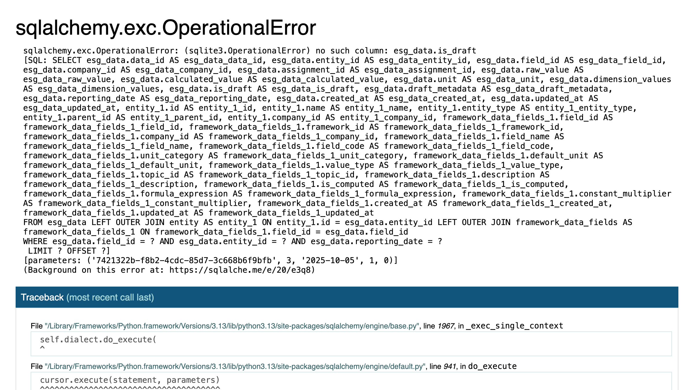

# Bug Report: Phase 4 Database Schema Migration Missing

**Test Date:** October 5, 2025
**Testing Agent:** UI Testing Agent
**Severity:** CRITICAL - Application Breaking
**Status:** BLOCKER
**Phase:** Phase 4 - Advanced Features

---

## Executive Summary

The Phase 4 implementation added new database columns (`is_draft` and `draft_metadata`) to the ESGData model, but these columns were not migrated to the actual database schema. This causes a **500 Internal Server Error** when accessing the User Dashboard V2, completely blocking all Phase 4 functionality testing.

---

## Error Details

### Error Type
`sqlalchemy.exc.OperationalError: (sqlite3.OperationalError) no such column: esg_data.is_draft`

### Affected Endpoint
- **URL:** `http://test-company-alpha.127-0-0-1.nip.io:8000/user/v2/dashboard`
- **HTTP Status:** 500 Internal Server Error
- **Request Type:** GET

### Error Location
```
File: /Users/prateekgoyal/Desktop/Prateek/ESG DataVault Development/Claude/sakshi-learning/app/routes/user_v2/dashboard.py
Line: 82
```

### Full SQL Query That Failed
```sql
SELECT esg_data.data_id AS esg_data_data_id,
       esg_data.entity_id AS esg_data_entity_id,
       esg_data.field_id AS esg_data_field_id,
       esg_data.company_id AS esg_data_company_id,
       esg_data.assignment_id AS esg_data_assignment_id,
       esg_data.raw_value AS esg_data_raw_value,
       esg_data.calculated_value AS esg_data_calculated_value,
       esg_data.unit AS esg_data_unit,
       esg_data.dimension_values AS esg_data_dimension_values,
       esg_data.is_draft AS esg_data_is_draft,                  -- ❌ MISSING COLUMN
       esg_data.draft_metadata AS esg_data_draft_metadata,      -- ❌ MISSING COLUMN
       esg_data.reporting_date AS esg_data_reporting_date,
       ...
FROM esg_data
WHERE esg_data.field_id = ?
  AND esg_data.entity_id = ?
  AND esg_data.reporting_date = ?
```

---

## Root Cause Analysis

### 1. Model Definition vs Database Schema Mismatch

**Model Definition** (app/models/esg_data.py, lines 32-34):
```python
# Phase 4: Draft support for auto-save functionality
is_draft = db.Column(db.Boolean, default=False, nullable=False)  # Flag to mark draft entries
draft_metadata = db.Column(db.JSON, nullable=True)  # Store additional draft metadata
```

**Actual Database Schema:**
```
sqlite> PRAGMA table_info(esg_data);
0|data_id|VARCHAR(36)|1||1
1|entity_id|INTEGER|1||0
2|field_id|VARCHAR(36)|1||0
3|company_id|INTEGER|0||0
4|assignment_id|VARCHAR(36)|0||0
5|raw_value|VARCHAR(255)|0||0
6|calculated_value|FLOAT|0||0
7|unit|VARCHAR(20)|0||0
8|dimension_values|JSON|0||0
9|reporting_date|DATE|1||0
10|created_at|DATETIME|0||0
11|updated_at|DATETIME|0||0
```

**Missing Columns:**
- `is_draft` (Boolean, default=False, nullable=False)
- `draft_metadata` (JSON, nullable=True)

### 2. Index Definition Also Missing

**Model Definition** (app/models/esg_data.py, line 69):
```python
# Phase 4: Add index for draft queries
db.Index('idx_esg_draft_lookup', 'field_id', 'entity_id', 'reporting_date', 'is_draft'),
```

This index also cannot be created until the `is_draft` column exists.

---

## Impact Assessment

### Affected Features (Cannot Be Tested)
1. ❌ **Auto-Save Functionality** - Core Phase 4 feature completely blocked
2. ❌ **Draft Data Management** - Cannot save or retrieve draft entries
3. ❌ **User Dashboard V2** - Entire dashboard inaccessible
4. ❌ **Phase 4 JavaScript Initialization** - Cannot verify client-side features
5. ❌ **Keyboard Shortcuts** - Cannot test due to page not loading
6. ❌ **Number Formatting** - Cannot test due to page not loading
7. ❌ **Performance Optimization** - Cannot test due to page not loading
8. ❌ **Bulk Paste Handler** - Cannot test due to page not loading

### User Experience Impact
- **Severity:** CRITICAL
- **User Impact:** 100% of users cannot access User Dashboard V2
- **Data Risk:** None (application fails before any data operations)
- **Recovery:** Requires database schema migration

---

## Evidence

### Screenshot 1: 500 Error Page


### Console Logs
```
[ERROR] Failed to load resource: the server responded with a status of 500 (INTERNAL SERVER ERROR)
@ http://test-company-alpha.127-0-0-1.nip.io:8000/user/v2/dashboard:0
```

### Network Requests
```
[GET] http://test-company-alpha.127-0-0-1.nip.io:8000/user/dashboard => [302] FOUND
[GET] http://test-company-alpha.127-0-0-1.nip.io:8000/user/v2/dashboard => [500] INTERNAL SERVER ERROR
```

---

## Required Fix

### Option 1: Manual Database Migration (Quick Fix)
```sql
-- Add missing columns to esg_data table
ALTER TABLE esg_data ADD COLUMN is_draft BOOLEAN NOT NULL DEFAULT 0;
ALTER TABLE esg_data ADD COLUMN draft_metadata TEXT;  -- SQLite uses TEXT for JSON

-- Add index for draft lookups
CREATE INDEX idx_esg_draft_lookup ON esg_data(field_id, entity_id, reporting_date, is_draft);
```

### Option 2: Proper Migration (Recommended)
1. Create database migration script
2. Test migration on development database
3. Document migration process
4. Add to deployment checklist

### Option 3: Database Rebuild (Development Only)
```bash
# Backup current database
cp instance/esg_data.db instance/esg_data.db.backup

# Drop and recreate database with new schema
python3 << EOF
from app import create_app
from app.extensions import db

app = create_app()
with app.app_context():
    db.drop_all()
    db.create_all()
EOF

# Re-seed data
python3 run.py
```

---

## Reproduction Steps

1. Login to application as user: bob@alpha.com / user123
2. Navigate to: `http://test-company-alpha.127-0-0-1.nip.io:8000/user/dashboard`
3. Application automatically redirects to `/user/v2/dashboard`
4. Page returns 500 error with database column error

---

## Testing Blocked

The following Phase 4 testing tasks are completely blocked until this issue is resolved:

- [ ] Page Load & Initialization
- [ ] Auto-Save Functionality
- [ ] Keyboard Shortcuts
- [ ] JavaScript Files Loading
- [ ] Number Formatter
- [ ] Console Error Check
- [ ] API Endpoints Testing
- [ ] Draft Management
- [ ] All UI interactions

---

## Recommendations

### Immediate Action Required
1. **Apply database migration immediately** - Use Option 1 (Manual Migration) for quick resolution
2. **Test database migration** - Verify columns are added correctly
3. **Re-run UI testing** - Complete Phase 4 testing suite
4. **Document migration** - Add to deployment documentation

### Prevention for Future Phases
1. **Add migration check** - Create pre-deployment checklist
2. **Automate schema validation** - Compare model vs database schema
3. **Integration testing** - Add test that validates database schema matches models
4. **Documentation** - Clearly document all schema changes in implementation summary

---

## Technical Notes

### Database System
- **Database:** SQLite
- **Location:** `/instance/esg_data.db`
- **ORM:** SQLAlchemy

### Migration Constraints
- SQLite has limited ALTER TABLE support
- Cannot change column types after creation
- Must use TEXT type for JSON columns (SQLite limitation)
- Boolean stored as INTEGER (0/1) in SQLite

### Related Files
- Model: `/app/models/esg_data.py` (lines 32-34, 69)
- Route: `/app/routes/user_v2/dashboard.py` (line 82)
- Implementation Guide: `PHASE_4_INTEGRATION_COMPLETE.md`

---

## Next Steps

1. ✅ Bug documented with full technical details
2. ⏳ Waiting for database migration to be applied
3. ⏳ Re-test Phase 4 features after fix
4. ⏳ Complete comprehensive UI testing

---

**Report Generated:** October 5, 2025
**Testing Agent:** UI Testing Agent
**Report Version:** v1
