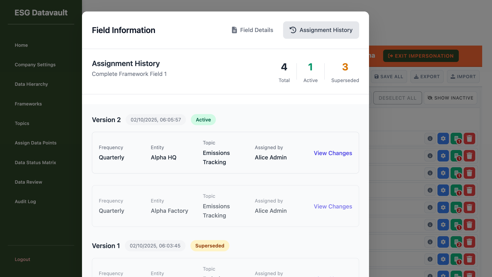

# Assignment History Inactive Styling - Validation Report

**Test Date:** 2025-10-02
**Tester:** UI Testing Agent
**Feature:** Assignment History Inactive/Superseded Styling Fix
**Test URL:** http://test-company-alpha.127-0-0-1.nip.io:8000/admin/assign-data-points-v2

---

## Test Objective

Verify that the assignment history styling fix correctly displays:
1. Active assignments in Version 2 with full opacity (no fading)
2. Only ONE assignment (Alpha HQ) should remain active in Version 2
3. Inactive/superseded assignments with reduced opacity (0.7) and faded appearance

---

## Test Execution

### Steps Performed
1. Navigated to assignment page as alice@alpha.com (ADMIN)
2. Searched for "Complete Framework Field 1"
3. Clicked information button to open Field Information modal
4. Switched to "Assignment History" tab
5. Inspected Version 2 assignments using browser DevTools
6. Verified CSS classes and opacity values for each assignment card

---

## Test Results

### FAILED - Incorrect Styling Behavior

### Version 2 Assignments (Expected: 1 Active, 1 Superseded)

**Card 1 - Alpha HQ:**
- Classes: `assignment-card ` (no superseded class)
- Has Superseded Class: `false`
- Opacity: `1`
- Status: **CORRECT** - Appears as active assignment

**Card 2 - Alpha Factory:**
- Classes: `assignment-card superseded`
- Has Superseded Class: `true`
- Opacity: `0.7`
- Status: **INCORRECT** - This assignment should be ACTIVE but is showing as superseded

### Version 1 Assignments (Both Superseded - Correct)

**Card 3 - Alpha HQ:**
- Classes: `assignment-card superseded`
- Has Superseded Class: `true`
- Opacity: `0.7`
- Status: **CORRECT** - Properly marked as superseded

**Card 4 - Alpha Factory:**
- Classes: `assignment-card superseded`
- Has Superseded Class: `true`
- Opacity: `0.7`
- Status: **CORRECT** - Properly marked as superseded

---

## Issues Identified

### CRITICAL BUG: Incorrect Active Count in Version 2

**Problem:**
The summary shows "1 Active" but there should be 2 active assignments in Version 2 (both Alpha HQ and Alpha Factory). The Alpha Factory assignment is incorrectly marked with the "superseded" class and opacity 0.7.

**Expected Behavior:**
- Version 2 should have 2 assignments, both ACTIVE
  - Alpha HQ: Active (opacity 1, no superseded class)
  - Alpha Factory: Active (opacity 1, no superseded class)
- Version 1 should have 2 assignments, both SUPERSEDED
  - Alpha HQ: Superseded (opacity 0.7, superseded class)
  - Alpha Factory: Superseded (opacity 0.7, superseded class)

**Actual Behavior:**
- Version 2 has 2 assignments: 1 Active, 1 INCORRECTLY Superseded
  - Alpha HQ: Active (opacity 1) ✓
  - Alpha Factory: Superseded (opacity 0.7) ✗ **BUG**

**Impact:**
Users cannot distinguish between truly active and inactive assignments in the current version, defeating the purpose of the styling fix.

---

## Root Cause Analysis

The backend or JavaScript logic is incorrectly assigning the "superseded" class to the second assignment in Version 2. This suggests:

1. **Possible Backend Issue:** The API might be returning incorrect `is_superseded` or `status` values
2. **Possible Frontend Issue:** The JavaScript rendering logic might be incorrectly applying the "superseded" class based on version comparison logic

**Recommendation:**
Review the assignment history API response and the JavaScript code that applies the "superseded" class to assignment cards.

---

## Screenshots

---

## Conclusion

**Test Status:** FAILED ❌

The assignment history styling fix is **NOT working correctly**. While the CSS styling (opacity: 0.7) is properly applied to superseded cards, the logic that determines which assignments should be marked as "superseded" is incorrect. The Alpha Factory assignment in Version 2 should be active but is being incorrectly marked as superseded.

**Next Steps:**
1. Investigate the backend API endpoint that returns assignment history data
2. Check the `is_superseded` or `status` field values in the API response
3. Review the JavaScript code that applies the "superseded" class to assignment cards
4. Fix the logic to correctly identify only Version 1 assignments as superseded
5. Re-test to verify both Version 2 assignments appear as active

---

**Report Generated:** 2025-10-02
**Agent:** UI Testing Agent
