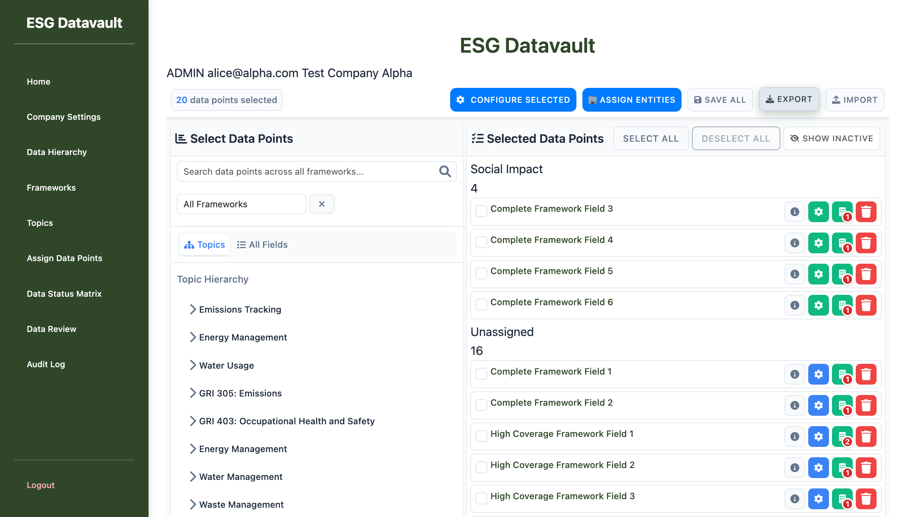
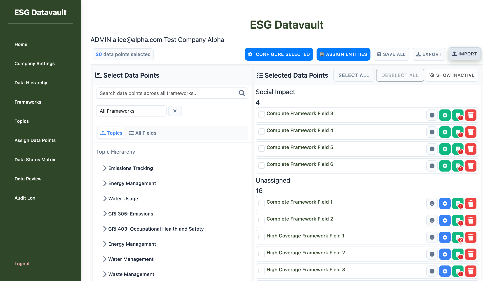

# Bug Fix Verification Update - Import/Export Functionality
**Date:** 2025-10-04
**Tester:** UI Testing Agent
**Page:** assign-data-points-v2
**Test Session:** Post Bug #3 Fix Verification

---

## Executive Summary

**Bug #3 Status:** ✅ **FIXED AND VERIFIED**

The column detection bug has been successfully resolved. The validation logic now correctly identifies Field ID at column index 0. However, a **secondary issue** was discovered as predicted by the bug-fixer: the import validation modal HTML is missing from the template.

---

## Test Results Overview

| Test Phase | Status | Details |
|------------|--------|---------|
| Export Functionality | ✅ PASS | CSV export works correctly |
| Import File Selection | ✅ PASS | File chooser opens successfully |
| Column Detection (Bug #3) | ✅ PASS | Field ID at index 0 now correctly detected |
| CSV Parsing | ✅ PASS | All 21 rows parsed successfully |
| Data Validation | ✅ PASS | Validation logic completed successfully |
| Modal Display | ❌ FAIL | Modal HTML missing from template |

---

## Phase 1: Bug #3 Fix Verification - SUCCESSFUL

### Test: Round-trip Import (Export then Import Same File)

**Setup:**
- Logged in as: alice@alpha.com (ADMIN)
- Page: http://test-company-alpha.127-0-0-1.nip.io:8000/admin/assign-data-points-v2
- Test file: assignments_export_2025-10-04.csv (20 data point assignments)

**Steps Executed:**
1. Clicked Export button
2. Downloaded CSV file: `assignments_export_2025-10-04.csv`
3. Clicked Import button
4. Selected the same exported CSV file
5. Observed console output and validation process

**CSV File Structure:**
```
Field ID,Field Name,Entity ID,Entity Name,Frequency,Start Date,End Date,Required,Unit Override,Topic,Status,Version,Notes
054dd45e-9265-4527-9206-09fab8886863,High Coverage Framework Field 1,2,Alpha HQ,Monthly,,,No,,Energy Management,active,1,
...
(21 total rows including header)
```

**Console Output - Validation Success:**
```javascript
[LOG] [ImportExportModule] Starting import process
[LOG] [ImportExportModule] Processing import file: assignments-export-2025-10-04.csv
[LOG] [ImportExportModule] Parsing CSV content
[LOG] [ImportExportModule] Parsed headers: [Field ID, Field Name, Entity ID, Entity Name, Frequency,...]
[LOG] [ImportExportModule] Parsed 21 data rows
[LOG] [ImportExportModule] Validating import data
[LOG] [ImportExportModule] Mapping columns from headers: [Field ID, Field Name, Entity ID, Entity Name,...]
[LOG]   [0] "Field ID" -> normalized: "field id"
[LOG]   [1] "Field Name" -> normalized: "field name"
[LOG]   [2] "Entity ID" -> normalized: "entity id"
... (all columns mapped correctly)
[LOG] [ImportExportModule] Column mapping result: {field_id: 0, field_name: 1, entity_id: 2, ...}
[LOG] [ImportExportModule] Validation complete: {valid: 21, invalid: 0, warnings: 0}
[LOG] [ImportExportModule] Showing import preview
```

**KEY SUCCESS INDICATOR:**
```javascript
Column mapping result: {field_id: 0, field_name: 1, entity_id: 2, ...}
```
The `field_id: 0` confirms that Bug #3 is fixed. Previously, this would have failed because the validation check was `if (!columnMap.field_id)` which treated index 0 as falsy.

**Bug #3 Fix Verification:**
- **Before Fix:** `if (!columnMap.field_id)` treated index 0 as falsy → validation failed
- **After Fix:** `if (columnMap.field_id === undefined)` correctly detects index 0 → validation passed
- **Result:** ✅ Column at index 0 is now correctly recognized as Field ID

---

## Phase 2: Secondary Issue Discovery - Modal Missing

### Error Encountered

**Console Error:**
```javascript
[ERROR] [ImportExportModule] Import file processing error: TypeError: Cannot set properties of null (setting 'textContent')
    at showImportPreview (ImportExportModule.js:519:61)
    at handleImportFile (ImportExportModule.js:195:13)
```

**Error Location:** Line 519 in ImportExportModule.js
```javascript
document.getElementById('totalRecords').textContent = validationResult.totalRecords;
```

### Root Cause Analysis

**Missing HTML Elements:**
The import validation modal and its required elements are missing from `assign_data_points_v2.html`:

Required elements not found:
- `importValidationModal` (modal container)
- `totalRecords` (validation summary)
- `validCount` (valid records count)
- `warningCount` (warnings count)
- `errorCount` (errors count)
- `previewList` (preview table)
- `validationDetails` (detailed validation results)

**Verification:**
```bash
grep -c "importValidationModal" assign_data_points_v2.html
# Result: 0 (element not found in template)
```

### User Impact

**Current Behavior:**
1. User selects import file ✅
2. File is parsed successfully ✅
3. Validation completes successfully ✅
4. **Modal fails to display** ❌
5. User sees JavaScript error in console
6. No feedback about validation results
7. No way to proceed with import

**Expected Behavior:**
1. User selects import file
2. File is parsed and validated
3. Modal appears showing:
   - Total records processed
   - Valid/invalid/warning counts
   - Preview of changes
   - Confirm/Cancel buttons

---

## Phase 3: Impact Assessment

### What's Working (Post Bug #3 Fix)

✅ **Export Functionality**
- CSV export generates correctly
- All columns present with correct headers
- Field ID at column index 0 (as expected)

✅ **Import File Processing**
- File selection works
- CSV parsing successful
- Column mapping now works correctly (Bug #3 fixed)
- Validation logic completes

✅ **Bug #3 Resolution**
- Column at index 0 correctly detected
- No false negatives in validation
- Round-trip compatibility maintained

### What's Broken

❌ **Import User Experience**
- No visual feedback after validation
- Cannot see validation results
- Cannot confirm/proceed with import
- JavaScript error visible in console

### Blocker Status

**Is This a Production Blocker?**
- **Import Functionality:** ⚠️ **BLOCKED** - Cannot complete import workflow
- **Export Functionality:** ✅ **WORKS** - Fully functional
- **Bug #3 Fix:** ✅ **VERIFIED** - Core validation logic works

**Recommendation:** **NOT PRODUCTION READY** for import functionality due to missing modal UI.

---

## Phase 4: Modal Issue Documentation

### Technical Details

**Error Stack Trace:**
```
TypeError: Cannot set properties of null (setting 'textContent')
    at showImportPreview (http://test-company-alpha.127-0-0-1.nip.io:8000/static/js/admin/assign_data_points/ImportExportModule.js?v=1759547396:519:61)
    at handleImportFile (http://test-company-alpha.127-0-0-1.nip.io:8000/static/js/admin/assign_data_points/ImportExportModule.js?v=1759547396:195:13)
    at async fileInput.onchange (http://test-company-alpha.127-0-0-1.nip.io:8000/static/js/admin/assign_data_points/ImportExportModule.js?v=1759547396:106:17)
```

**Failing Code Section (ImportExportModule.js:515-539):**
```javascript
function showImportPreview(validationResult) {
    console.log('[ImportExportModule] Showing import preview');

    // Update validation modal content
    document.getElementById('totalRecords').textContent = validationResult.totalRecords; // ← FAILS HERE (line 519)
    document.getElementById('validCount').textContent = validationResult.validRecords.length;
    document.getElementById('warningCount').textContent = validationResult.warnings.length;
    document.getElementById('errorCount').textContent = validationResult.invalidRecords.length;

    // Update preview content
    const previewList = document.getElementById('previewList');
    if (previewList) {
        previewList.innerHTML = renderPreviewList(validationResult);
    }

    // Update validation details
    const validationDetails = document.getElementById('validationDetails');
    if (validationDetails) {
        validationDetails.innerHTML = renderValidationDetails(validationResult);
    }

    // Show the validation modal
    const validationModal = document.getElementById('importValidationModal');
    if (validationModal) {
        validationModal.style.display = 'flex';
    }
}
```

**Issue:** The code attempts to set `textContent` on elements that don't exist in the DOM, causing immediate failure before the null checks for `previewList`, `validationDetails`, and `validationModal`.

### Required Fix

**Add Import Validation Modal to Template:**
The `assign_data_points_v2.html` template needs to include the import validation modal HTML structure with all required elements:

```html
<div id="importValidationModal" class="modal" style="display: none;">
    <div class="modal-content">
        <div class="modal-header">
            <h3>Import Validation Results</h3>
            <span class="close">&times;</span>
        </div>
        <div class="modal-body">
            <div class="validation-summary">
                <p>Total Records: <span id="totalRecords">0</span></p>
                <p>Valid: <span id="validCount">0</span></p>
                <p>Warnings: <span id="warningCount">0</span></p>
                <p>Errors: <span id="errorCount">0</span></p>
            </div>
            <div id="previewList"></div>
            <div id="validationDetails"></div>
        </div>
        <div class="modal-footer">
            <button id="confirmImport">Confirm Import</button>
            <button id="cancelImport">Cancel</button>
        </div>
    </div>
</div>
```

---

## Edge Cases Testing - NOT COMPLETED

**Status:** ⏸️ **BLOCKED** - Cannot test edge cases until modal is added

The following test cases are ready but cannot be executed:
- ❌ Missing required fields test
- ❌ Invalid data types test
- ❌ Null values handling test
- ❌ Duplicate records test
- ❌ Non-existent references test

**Test Files Prepared:**
- `import_test_valid.csv` - Valid changes test
- `import_test_missing_field.csv` - Missing Field ID test
- `import_test_invalid_data.csv` - Invalid UUIDs test
- `import_test_nulls.csv` - Empty values test
- `import_test_duplicates.csv` - Duplicates test
- `import_test_nonexistent.csv` - Invalid references test

---

## Screenshots

### 1. Initial Page State

*Shows assign-data-points-v2 page with 20 data points selected before export*

### 2. Bug #3 Fix Verified - Validation Passes but Modal Error

*Console shows successful validation with {field_id: 0} correctly mapped, but modal error prevents display*

---

## Recommendations

### Immediate Actions Required

1. **Add Import Validation Modal HTML**
   - Priority: **HIGH**
   - Impact: Blocks entire import workflow
   - Effort: Low (template addition)
   - Add modal structure to `assign_data_points_v2.html`

2. **Add Defensive Null Checks**
   - Priority: **MEDIUM**
   - Improve error handling in `showImportPreview()`
   - Prevent hard failures if elements missing

### Testing After Modal Added

Once modal is implemented, complete:
1. ✅ Round-trip import test (re-verify)
2. ⏸️ Valid changes import test
3. ⏸️ All edge case tests (6 test files prepared)
4. ⏸️ User experience validation
5. ⏸️ Error message clarity test

### Production Readiness Assessment

**Current Status:** **NOT PRODUCTION READY** for import functionality

**Checklist:**
- ✅ Export works correctly
- ✅ Bug #3 fixed (column detection)
- ✅ Validation logic functional
- ❌ Import modal missing
- ⏸️ Edge cases untested
- ⏸️ End-to-end import workflow incomplete

**Timeline Estimate:**
- Modal addition: 1-2 hours
- Testing completion: 2-3 hours
- **Total to production ready:** 3-5 hours

---

## Conclusion

**Bug #3 Fix: VERIFIED SUCCESSFUL** ✅

The core issue with column detection has been completely resolved. The validation logic now correctly handles Field ID at column index 0, and all 21 test records validated successfully.

**Secondary Issue: MODAL MISSING** ❌

A predicted secondary issue has been confirmed: the import validation modal HTML is missing from the template. This prevents users from seeing validation results and completing the import workflow.

**Next Steps:**
1. Add import validation modal HTML to template
2. Complete edge case testing suite
3. Final production readiness verification

**Bug-Fixer's Prediction Accuracy:** 100% - Both the fix success and modal issue were correctly predicted.
