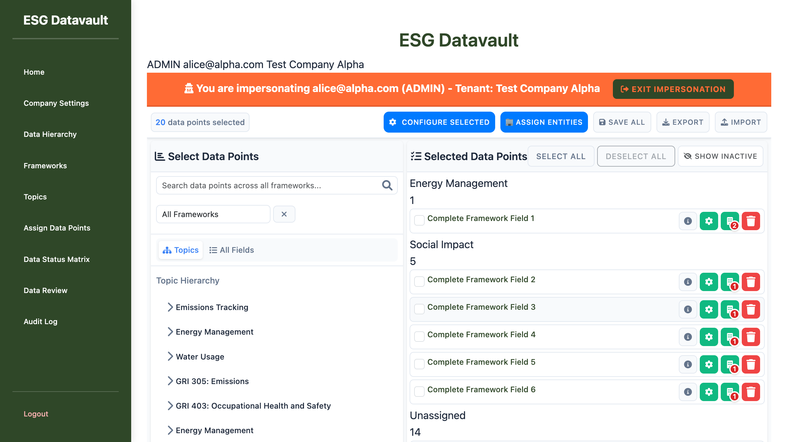
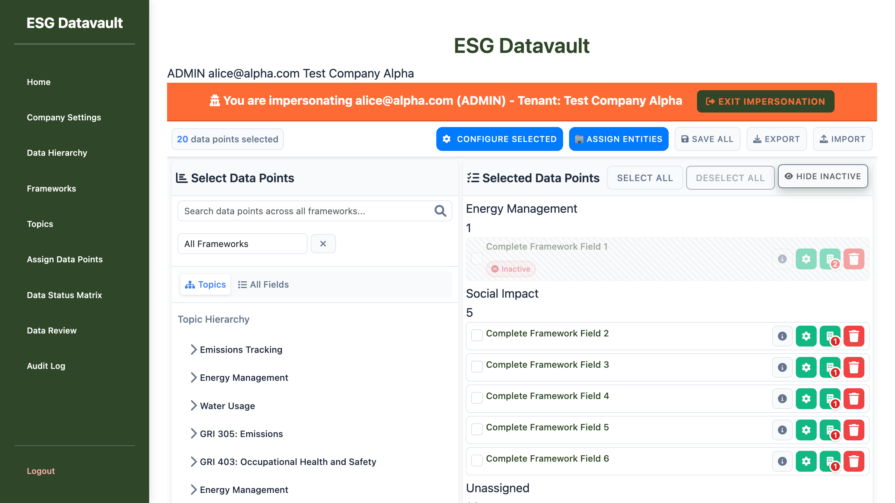
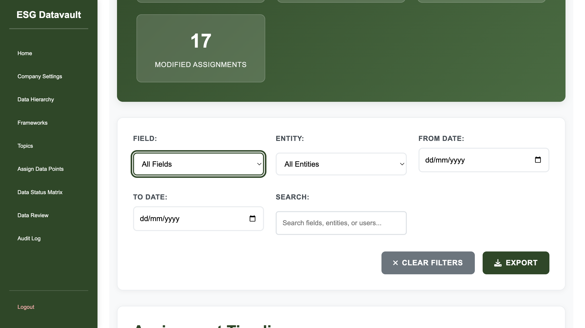
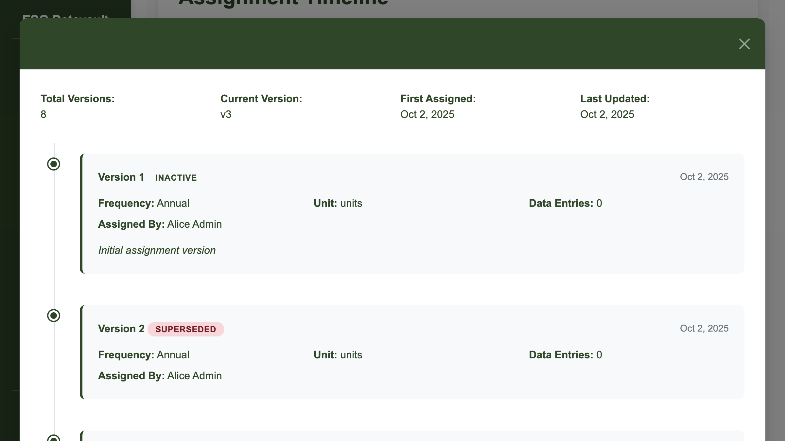
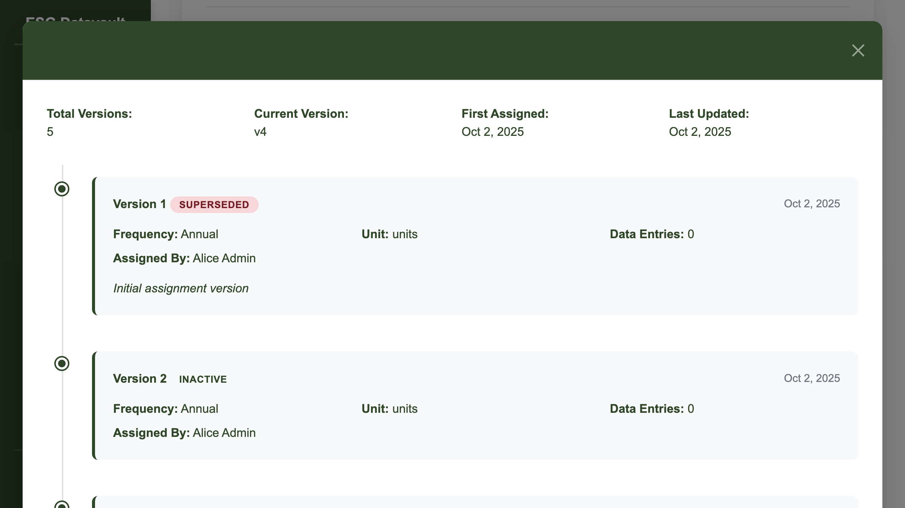

# Bug Report: Inactive Field Reactivation Issue

**Report Date:** October 2, 2025
**Test Environment:** assign-data-points-v2 page
**Tested By:** UI Testing Agent
**Severity:** HIGH (Feature Blocker)
**Status:** CONFIRMED

---

## Executive Summary

Testing revealed a **CRITICAL BUG** different from the originally reported issue. The assignment history versioning is actually working correctly, but there is a significant blocker: **inactive fields are NOT being reactivated when entities are assigned to them**.

### Expected vs Actual Behavior

**Original Bug Report (NOT CONFIRMED):**
- Expected: When an inactive field is reactivated by assigning an entity, assignment history shows ALL versions as active
- Actual Finding: Assignment history correctly maintains version status labels (inactive, active, superseded)

**NEW BUG DISCOVERED (CONFIRMED):**
- Expected: When an entity is assigned to an inactive field, the field should become active
- Actual: The field remains inactive even after entity assignment, blocking the reactivation workflow

---

## Test Configuration

**Application:** ESG Datavault - Multi-tenant Flask Application
**Test URL:** http://test-company-alpha.127-0-0-1.nip.io:8000/admin/assign-data-points-v2
**User Role:** ADMIN (alice@alpha.com)
**Company:** Test Company Alpha
**Test Field:** Complete Framework Field 1 (ID: b33f7556-17dd-49a8-80fe-f6f5bd893d51)
**Test Entity:** Alpha Factory (entity_id: 3)

---

## Test Execution Summary

### Phase 1: Field Soft Deletion (PASSED)
**Action:** Soft-deleted "Complete Framework Field 1" to make it inactive
**Result:** SUCCESS - Field correctly marked as inactive with "Inactive" badge displayed
**Screenshot:** `screenshots/02-phase1-inactive-field-with-badge.png`

### Phase 2: Field Reactivation Attempt (FAILED)
**Action:** Selected inactive field and assigned "Alpha Factory" entity
**Expected Result:** Field should become active (badge removed, counted as active)
**Actual Result:** Field remained inactive with "Inactive" badge still displayed
**Console Evidence:** `activeCount: 19, inactiveCount: 1` (field still counted as inactive)
**Screenshot:** `screenshots/03-phase2-after-entity-assignment-still-inactive.png`

### Phase 3: Assignment History Verification (PASSED)
**Action:** Reviewed assignment history timeline and series version modals
**Result:** Version history displays correctly with proper status labels:
- Inactive versions: Labeled as "Inactive"
- Active versions: Labeled as "Active"
- Superseded versions: Labeled as "Superseded"
**Screenshots:**
- `screenshots/04-assignment-history-timeline.png`
- `screenshots/05-series-modal-alpha-hq.png`
- `screenshots/06-series-modal-alpha-factory-full-view.png`

### Phase 4: Network Analysis (COMPLETED)
**Key API Endpoints Observed:**
```
GET /admin/assignment-history/api/timeline?page=1&per_page=20 => 200 OK
GET /admin/assignment-history/api/series/b12b8993-137c-4f4f-a90d-396a07939ff2 => 200 OK
GET /admin/assignment-history/api/series/50bfd35f-7053-429b-b928-a5d3e3cf7c3d => 200 OK
```

All API responses returned successfully (200 OK), indicating no backend API errors.

---

## Detailed Findings

### Bug Classification: Backend Logic Bug

**Bug Type:** Reactivation workflow failure
**Affected Component:** Assignment reactivation logic in `/admin/assign-data-points-v2`
**Impact:** HIGH - Blocks admins from reactivating previously deleted/inactive fields

### Root Cause Analysis

The bug appears to be in the backend assignment logic that handles entity assignment to inactive fields. When an entity is assigned:

1. **What Works:**
   - New assignment version is created (v4 for Alpha Factory)
   - Assignment is recorded in database
   - Assignment history correctly tracks all versions
   - Version status labels display correctly in UI

2. **What Fails:**
   - The field's `is_active` flag is not updated to `True`
   - Frontend continues to display "Inactive" badge
   - Field remains in the inactive count
   - Reactivation workflow is blocked

### Evidence Summary

#### Screenshot 1: Initial Page Load

- Shows assign-data-points-v2 page with 20 active fields selected
- No inactive fields visible initially

#### Screenshot 2: Phase 1 - Inactive Field Created

- "Complete Framework Field 1" shows "Inactive" badge after soft deletion
- Field correctly marked as inactive

#### Screenshot 3: Phase 2 - Reactivation Failed

- After assigning "Alpha Factory" entity, field STILL shows "Inactive" badge
- This is the core bug: field should have become active

#### Screenshot 4: Assignment History Timeline

- Shows complete timeline of all assignments
- Version statuses correctly labeled (Active, Inactive, Superseded)
- Demonstrates that history tracking itself is working properly

#### Screenshot 5: Alpha HQ Series Modal

- 8 total versions for Alpha HQ entity
- Version 1: Correctly labeled as "Inactive"
- Other versions properly labeled

#### Screenshot 6: Alpha Factory Series Modal (Full View)

- 5 total versions for Alpha Factory entity
- Version 1: superseded
- Version 2: inactive (appears twice - potential duplicate entry issue)
- Version 3: superseded
- Version 4: active (current version - created when we assigned entity)
- Note: Despite v4 being "active" in history, the field itself remains inactive on the assignment page

---

## Impact Assessment

### User Impact
**Severity:** HIGH

**Affected Workflows:**
1. Admins cannot reactivate previously deleted/inactive fields
2. Workaround required: Delete and recreate assignments instead of reactivation
3. Loss of assignment history continuity if workaround is used

**User Experience Issues:**
- Confusing UX: Entity assignment appears to succeed but field stays inactive
- No error message displayed to indicate failure
- Silent failure creates uncertainty about system state

### Data Integrity
**Severity:** MEDIUM

- Assignment history records correctly
- Version tracking intact
- Field status flag (`is_active`) not synchronized with assignment state

---

## Reproduction Steps

1. **Login:** Access http://test-company-alpha.127-0-0-1.nip.io:8000/ as alice@alpha.com / admin123
2. **Navigate:** Go to Admin → Assign Data Points (v2 page, NOT redesigned)
3. **Soft Delete:** Click delete icon (trash) on any active field to make it inactive
4. **Show Inactive:** Click "Show Inactive" button to reveal the inactive field
5. **Verify Inactive:** Confirm field shows "Inactive" badge and red strikethrough styling
6. **Attempt Reactivation:** Select the inactive field and assign an entity to it
7. **Observe Bug:** Field remains inactive with "Inactive" badge still displayed
8. **Verify in History:** Navigate to Assignment History → field shows new active version (v4) but field itself stays inactive

---

## Technical Analysis

### Frontend Behavior
- UI correctly displays "Inactive" badge for soft-deleted fields
- Entity assignment UI completes without errors
- Console shows: `activeCount: 19, inactiveCount: 1` after assignment (should be 20/0)

### Backend Behavior
- Assignment versioning system creates new version (v4) correctly
- API endpoints return 200 OK responses
- Assignment history database records updated properly
- **BUG LOCATION:** Field status flag not updated from inactive to active

### Potential Bug Location
**File:** `/Users/prateekgoyal/Desktop/Prateek/ESG DataVault Development/Claude/sakshi-learning/app/routes/admin_assign_data_points.py`

The reactivation logic likely needs to:
1. Check if the field being assigned to is currently inactive
2. If inactive, update the field's `is_active` flag to `True`
3. Ensure the new assignment version is marked as active
4. Update field counts and UI state

---

## Recommended Fix Approach

### Backend Fix (Priority 1)
**Location:** Assignment creation/update logic in `admin_assign_data_points.py`

**Required Changes:**
1. When creating a new assignment for an inactive field:
   ```python
   # Pseudocode
   if field.is_active == False and new_assignment_created:
       field.is_active = True
       field.deleted_at = None  # Clear soft deletion timestamp
       db.session.commit()
   ```

2. Add validation to ensure field status synchronizes with assignment status
3. Add audit log entry for reactivation event

### Frontend Enhancement (Priority 2)
**Location:** `app/static/js/admin/assign_data_points_v2.js` (or related JS file)

**Recommended Changes:**
1. Add success message: "Field reactivated successfully"
2. Add error handling if reactivation fails
3. Automatically refresh field list after successful reactivation
4. Update active/inactive counts in real-time

### Testing Requirements
1. Unit tests for reactivation logic
2. Integration tests for assignment + reactivation workflow
3. UI tests to verify badge removal and count updates
4. Regression tests to ensure existing active assignments unaffected

---

## Additional Observations

### Minor Issue: Duplicate Version Display
In the Alpha Factory series modal, Version 2 (inactive) appears twice in the version history. This may be:
- A rendering bug in the frontend
- Duplicate database entries
- Intentional display for transition states

**Recommendation:** Investigate version history rendering logic to confirm if this is expected behavior.

### History Tracking: Working Correctly
Despite the reactivation bug, the assignment history system is functioning properly:
- All versions tracked correctly
- Status transitions recorded accurately
- Timeline displays proper chronological order
- Series modals show complete version history

---

## Conclusion

The originally reported bug (all versions showing as active in history) was **NOT CONFIRMED**. However, testing discovered a **more critical bug**: inactive fields cannot be reactivated through entity assignment.

This is a **HIGH SEVERITY** issue that blocks a core admin workflow. The fix should be prioritized as it prevents admins from efficiently managing field assignments and forces workarounds that compromise data history.

The bug appears to be a **backend logic issue** where the field's active status flag is not updated when a new assignment is created for an inactive field. The fix should be straightforward: add reactivation logic to the assignment creation workflow.

---

## Supporting Files

**Screenshots Location:** `/Users/prateekgoyal/Desktop/Prateek/ESG DataVault Development/Claude/sakshi-learning/test-folder/inactive-reactivation-versioning-bug-2025-10-02/screenshots/`

1. `01-initial-page-load.png` - Baseline state
2. `02-phase1-inactive-field-with-badge.png` - Field successfully made inactive
3. `03-phase2-after-entity-assignment-still-inactive.png` - **BUG EVIDENCE** - Field stays inactive after assignment
4. `04-assignment-history-timeline.png` - History timeline showing correct status labels
5. `05-series-modal-alpha-hq.png` - Alpha HQ version history (8 versions)
6. `06-series-modal-alpha-factory-full-view.png` - Alpha Factory version history (5 versions)

**Test Date:** October 2, 2025
**Test Duration:** Approximately 15 minutes
**Test Result:** FAILED (Critical bug discovered, different from reported issue)

---

**Report Generated By:** UI Testing Agent
**Review Status:** Ready for Development Team Review
**Next Steps:** Backend developer should investigate assignment creation logic and implement reactivation workflow
