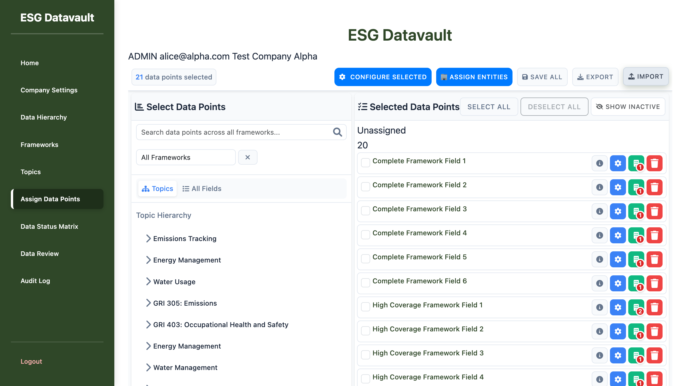

# Bug Report: Import Preview Modal Not Visible

**Report Date:** 2025-10-04
**Severity:** HIGH - Blocking Feature
**Component:** Import/Export Module - Import Preview Modal
**Environment:** Admin Assign Data Points Page

---

## Executive Summary

The import preview modal is completely invisible after file selection, preventing users from reviewing and confirming imports. While the modal exists in the DOM with correct data, it has `opacity: 0` due to a missing CSS class, making it functionally unusable.

---

## Bug Description

### What Should Happen
1. User clicks "Import" button on Assign Data Points page
2. File chooser opens
3. User selects a valid CSV file
4. Import preview modal appears showing:
   - Total records, valid/invalid counts
   - Preview of data to be imported
   - Validation errors/warnings (if any)
   - "Proceed with Import" and "Cancel Import" buttons

### What Actually Happens
1. User clicks "Import" button ✅
2. File chooser opens ✅
3. User selects a valid CSV file ✅
4. **Modal remains completely invisible** ❌
   - No visual feedback to user
   - Cannot review import data
   - Cannot proceed with or cancel import
   - User has no indication that file was processed

---

## Root Cause Analysis

### Technical Investigation

**File:** `/app/static/js/admin/assign_data_points/ImportExportModule.js`
**Function:** `showImportPreview()` (lines 515-549)

**Current Implementation:**
```javascript
function showImportPreview(validationResult) {
    console.log('[ImportExportModule] Showing import preview');

    // Update modal content...
    document.getElementById('totalRecords').textContent = validationResult.totalRecords;
    // ... more content updates ...

    // Show the validation modal
    const validationModal = document.getElementById('importValidationModal');
    if (validationModal) {
        validationModal.style.display = 'flex';  // ❌ ONLY sets display
    }
    // ...
}
```

**CSS Requirements:**
**File:** `/app/static/css/admin/assign_data_points/modals_redesigned.css` (lines 1314-1331)

```css
.import-validation-modal-overlay {
    position: fixed;
    top: 0;
    left: 0;
    width: 100%;
    height: 100%;
    background: rgba(0, 0, 0, 0.5);
    display: flex;
    justify-content: center;
    align-items: center;
    z-index: 10000;
    opacity: 0;  /* ⚠️ Initially invisible */
    transition: opacity 0.3s ease;
}

.import-validation-modal-overlay.show {
    opacity: 1;  /* ✅ Visible only with .show class */
}
```

### The Problem

The JavaScript sets `display: flex` but **does not add the `.show` class** required by the CSS to set `opacity: 1`. The modal remains at `opacity: 0`, making it completely invisible.

**Computed Style Verification:**
```json
{
  "display": "flex",         // ✅ Set by JS
  "visibility": "visible",   // ✅ Default
  "opacity": "0",            // ❌ PROBLEM - needs .show class
  "zIndex": "10000",         // ✅ Correct
  "position": "fixed",       // ✅ Correct
  "width": "1200px",         // ✅ Correct
  "height": "675px"          // ✅ Correct
}
```

---

## Evidence

### Visual Evidence

**Before Import Click:**

*Page state before clicking Import button - normal view*

**After File Selection (Modal Should Appear):**

*Modal is in DOM with correct data but completely invisible to user*

### DOM Evidence

The modal exists in the page snapshot with all correct content:
```yaml
- generic [ref=e517]:  # importValidationModal exists
  - generic [ref=e518]:
    - heading "📊 Import Summary" [level=4]
    - generic: "Total Records: 2"
    - generic: "✅ Valid: 2"
    - generic: "⚠️ Warnings: 0"
    - generic: "❌ Errors: 0"
  - button "Cancel Import" [ref=e553] [cursor=pointer]
  - button "Proceed with Import" [ref=e554] [cursor=pointer]
```

### Console Logs Confirmation

JavaScript executes correctly:
```
[ImportExportModule] Starting import process
[ImportExportModule] Processing import file: test_import.csv
[ImportExportModule] Parsing CSV content
[ImportExportModule] Parsed headers: ["Field ID", "Field Name", ...]
[ImportExportModule] Parsed 2 data rows
[ImportExportModule] Validating import data
[ImportExportModule] Validation complete: {valid: 2, invalid: 0, warnings: 0}
[ImportExportModule] Showing import preview  ⚠️ Function called
```

No JavaScript errors occurred. The modal content is correctly populated but remains invisible.

---

## Impact Assessment

### User Impact
- **Severity:** HIGH - Feature Completely Blocked
- **User Experience:** Severely broken - no feedback after file selection
- **Data Risk:** LOW - No import occurs (user cannot proceed)
- **Workaround:** NONE - Feature is unusable

### Business Impact
- Import functionality is completely unavailable
- Users cannot bulk import assignments
- Manual data entry required for all assignments
- Significantly reduced productivity for bulk operations

---

## Reproduction Steps

**Prerequisites:**
- Login as Admin: alice@alpha.com / admin123
- Navigate to: http://test-company-alpha.127-0-0-1.nip.io:8000/admin/assign-data-points

**Steps:**
1. Click "Import" button in toolbar
2. Select any valid CSV file (e.g., test_import.csv)
3. **Observe:** No modal appears
4. **Check:** Console shows "[ImportExportModule] Showing import preview"
5. **Verify:** Inspect DOM - modal exists with opacity: 0

**Expected:** Modal appears with import preview
**Actual:** Page remains unchanged, modal invisible

---

## Recommended Fix

### Code Change Required

**File:** `/app/static/js/admin/assign_data_points/ImportExportModule.js`
**Function:** `showImportPreview()`
**Line:** ~539

**Current Code:**
```javascript
// Show the validation modal
const validationModal = document.getElementById('importValidationModal');
if (validationModal) {
    validationModal.style.display = 'flex';
}
```

**Fixed Code:**
```javascript
// Show the validation modal
const validationModal = document.getElementById('importValidationModal');
if (validationModal) {
    validationModal.style.display = 'flex';
    // Add .show class to trigger opacity transition
    setTimeout(() => {
        validationModal.classList.add('show');
    }, 10); // Small delay for CSS transition to work
}
```

### Corresponding Fix for Close Function

**File:** `/app/static/js/admin/assign_data_points/ImportExportModule.js`
**Function:** `closeImportModal()`
**Line:** ~648

**Current Code:**
```javascript
function closeImportModal() {
    const validationModal = document.getElementById('importValidationModal');
    if (validationModal) {
        validationModal.style.display = 'none';
    }
    // ...
}
```

**Fixed Code:**
```javascript
function closeImportModal() {
    const validationModal = document.getElementById('importValidationModal');
    if (validationModal) {
        // Remove .show class first for fade-out transition
        validationModal.classList.remove('show');
        // Hide after transition completes
        setTimeout(() => {
            validationModal.style.display = 'none';
        }, 300); // Match CSS transition duration
    }
    // ...
}
```

---

## Testing Verification Required

After fix implementation, verify:

1. **Modal Appearance:**
   - Modal fades in smoothly (0.3s transition)
   - All content visible and readable
   - Modal centered on screen
   - Semi-transparent overlay visible behind modal

2. **Modal Functionality:**
   - Import summary shows correct counts
   - Preview list displays sample records
   - Validation errors/warnings displayed correctly
   - "Proceed with Import" button enabled for valid records
   - "Cancel Import" closes modal

3. **Modal Dismissal:**
   - Cancel button fades out modal smoothly
   - Close (X) button works correctly
   - Modal removed from view after close

4. **Edge Cases:**
   - Test with various CSV files (valid, invalid, mixed)
   - Test with large file (>100 records)
   - Test rapid open/close cycles
   - Test multiple imports in sequence

---

## Related Files

### Affected Files
- `/app/static/js/admin/assign_data_points/ImportExportModule.js` - Main bug location
- `/app/static/css/admin/assign_data_points/modals_redesigned.css` - CSS definition (correct)
- `/app/templates/admin/assign_data_points_redesigned.html` - Modal HTML (correct)

### Test Files
- `/test-folder/test_import.csv` - Sample test file used for reproduction

---

## Additional Notes

### Why This Bug Occurred

This appears to be a CSS/JS integration oversight where:
1. The CSS was designed with a `.show` class pattern for smooth transitions
2. The JavaScript was implemented to only change `display` property
3. The `.show` class was never added in the JavaScript code

This is a common pattern when CSS and JS are developed/modified separately without coordination.

### Prevention Recommendations

1. When using CSS transitions with opacity, always verify corresponding JavaScript adds required classes
2. Add integration tests that verify modal visibility (not just DOM presence)
3. Code review checklist: "Does modal use opacity transitions? Are classes toggled correctly?"

---

## Status

- **Identified:** 2025-10-04
- **Reported By:** ui-testing-agent (Claude Code)
- **Assigned To:** backend-developer / ui-developer
- **Priority:** HIGH
- **Status:** OPEN - Awaiting Fix

---

## Appendix: Test Data Used

**File:** test_import.csv
```csv
Field ID,Field Name,Entity ID,Entity Name,Frequency,Start Date,End Date,Required,Unit Override,Notes
CF-FIELD-1,Complete Framework Field 1,1,Headquarters,Monthly,2024-01-01,2024-12-31,Yes,kWh,Test import
CF-FIELD-2,Complete Framework Field 2,1,Headquarters,Quarterly,2024-01-01,2024-12-31,No,,Another test
```

Both records validated successfully with:
- Total Records: 2
- Valid: 2
- Warnings: 0
- Errors: 0

Modal populated correctly but remained invisible.
